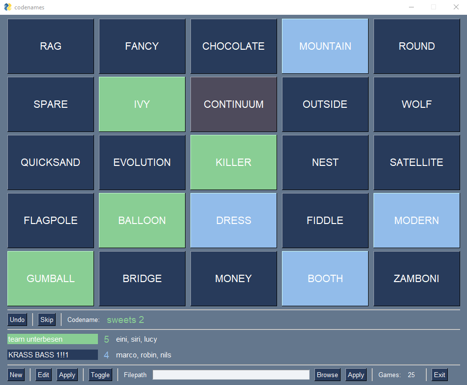

# codenames-pysimplegui

(local) codenames game (toggle view) #python, pysimplegui

**input file syntax**

\##### players  
player1 player2 ...  
... playerN-1 playerN  
\##### words  
word1 word2 ...  
... wordN-1 wordN  
\##### end
