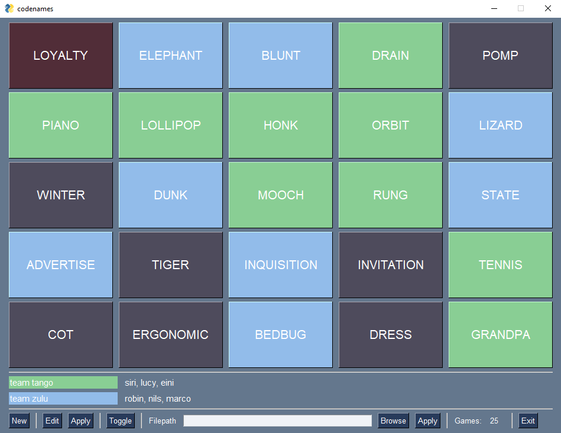

# codenames-pysimplegui

small python project - (first days using python) spaghetti code

**input file semantic**

\##### players  
player1 player2 ...  
... playerN-1 playerN  
\##### words  
word1 word2 ...  
... wordN-1 wordN  
\##### end
